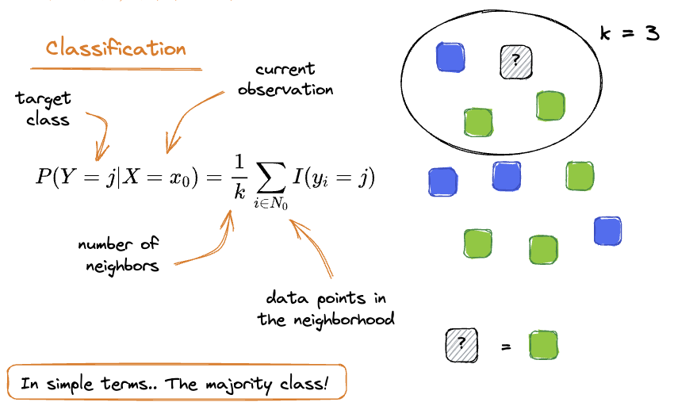
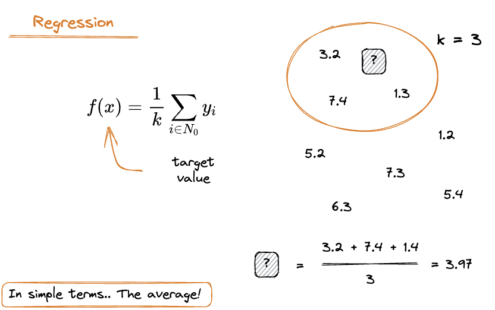

# K-Nearest Neighbor

K-Nearest Neighbor is a `supervised learning algorithm` which relies on the assumption that nearby points tend to be similar. Therefore, once we define a `distance metric`, we define an integer `K` which represents the number of points that belong to the `neighborhood`. 

For `classification` problems, the final prediction will be given by the majority class in the neighborhood, whereas in `regression` problem we simply take the average between the observations. 

|<center>[source](https://illustrated-machine-learning.github.io/)</center>|<center>[source](https://illustrated-machine-learning.github.io/)</center>|
|:---:|:---|
|  | |

<br />

The full implementation is available [here](./knn.py)!

--- 

### Demo

Import sklearn in order to create a random dataset and to compare our performance with the pre-implemented one. 

```python
from sklearn.datasets import make_classification
from sklearn.neighbors import KNeighborsClassifier
from sklearn.metrics import accuracy_score
```

Create the dataset via `make_classification`.

```python
X, y = make_classification(
        n_samples=1000, 
        n_features=10, 
        n_informative = 7,
        n_classes = 2, 
        random_state=42 
    )
X_train, y_train = X[:700], y[:700]
X_test, y_test = X[700:], y[700:]
```

Evaluate our model.

```python
knn = KNN(n_neighbors=5, metric='euclidean')
y_pred = knn.fit_predict(X_train,y_train,X_test)
print(f'Accuracy = {accuracy_score(y_test,y_pred):.2f}')
```

```
Accuracy = 0.90
```

Evaluate the implementation available in scikit-learn:
```python
scikit_knn = KNeighborsClassifier(n_neighbors=5, algorithm='brute', p=2)
scikit_knn.fit(X_train,y_train)
scikit_pred = scikit_knn.predict(X_test)
print(f'Accuracy = {accuracy_score(y_test,scikit_pred):.2f}')
```

```
Accuracy = 0.90
```